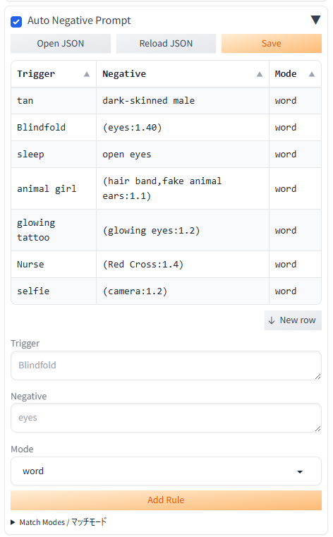

# Auto Negative Prompt

指定プロンプトに対応したネガティブプロンプトを自動で追記する Stable Diffusion WebUI reForge 用の拡張機能です。  
Stable Diffusion Forge NEO にも対応しています。

Auto Negative Prompt is a Stable Diffusion WebUI reForge extension that automatically appends mapped negative prompt terms for matching prompt triggers.  
It also supports Stable Diffusion Forge NEO.



## Features

- Always-visible `InputAccordion` UI, matching the compact WebUI extension style
- Editable rule table with `Trigger`, `Negative`, and `Mode`
- `Open JSON`, `Reload JSON`, and `Save` controls
- Trigger matching with `word`, `contains`, `exact`, `and-*`, `not-*`, and expression syntax
- Skips negative terms that already exist in the current negative prompt
- Hires negative prompts are handled separately when available
- Local rule files are kept out of Git by default

## Install

Clone this repository into your WebUI `extensions` directory:

```bash
git clone https://github.com/null0516/sd-auto-negative.git sd-auto-negative
```

Then restart the WebUI.

## Rules

Rules are stored as JSON objects:

```json
{
  "enabled": true,
  "trigger": "landscape, scenery",
  "negative": "low quality, blurry, jpeg artifacts",
  "match_mode": "word"
}
```

The extension reads `auto_negative_rules.json` first. This file is local/user-specific and is ignored by Git.

If `auto_negative_rules.json` does not exist, the extension copies rules from `auto_negative_rules.example.json` and creates a local `auto_negative_rules.json` automatically.

Existing negative prompt terms are normalized and checked before insertion. If the same negative term already exists, Auto Negative Prompt will not add it again.  
既存のネガティブプロンプト内に同じネガティブ語がある場合、その語は重複して追記されません。

## Match Modes

| Mode | Behavior |
| --- | --- |
| `word` | Word boundary match |
| `contains` | Partial text match |
| `exact` | Exact comma-separated token match |
| `and-word` / `and-contains` / `and-exact` | All trigger terms must match |
| `not-word` / `not-contains` / `not-exact` | Fires when trigger terms do not match |
| expression | Use `&`, `|`, `!`, and parentheses, for example `landscape & (rain | fog)` |

Comma-separated triggers use OR matching.

## Files

```text
sd-auto-negative/
├── scripts/
│   └── auto_negative_prompt.py
├── auto_negative_rules.example.json
├── auto_negative_rules.json      # local only, ignored by Git
├── .gitignore
└── README.md
```

## Compatibility

- Stable Diffusion WebUI reForge
- Stable Diffusion Forge NEO
- Gradio 3.x / 4.x WebUI forks

## Privacy

`auto_negative_rules.json` is intended for personal rules and is listed in `.gitignore`. Commit `auto_negative_rules.example.json` instead when publishing the extension.

## License

MIT License. See [LICENSE](LICENSE).
